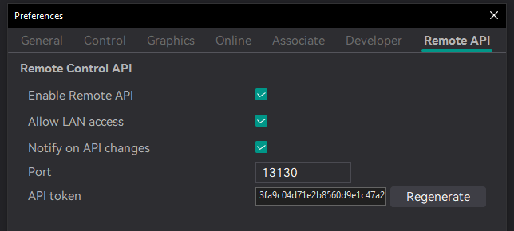

> [!NOTE]
> **This is the MCP fork of Flash Studio (Orca-Flashforge).** It adds a token-authenticated local Remote API so AI assistants can work the slicer: load models, edit settings, slice, read per-feature breakdowns, and render the plate. The Remote API is ported from the [`remote-api`](https://github.com/MaxEllis/OrcaSlicer/tree/remote-api) branch of MaxEllis/OrcaSlicer; pair this build with the [orcaslicer-mcp](https://github.com/MaxEllis/orcaslicer-mcp) server. Everything below this note is the upstream Orca-Flashforge README.
>
> Enable the API in **Preferences** (Ctrl+P) under **Remote Control API**: tick **Enable Remote API**, copy the token, and tick **Allow LAN access** only if the MCP server runs on another machine.
>
> 
>
> \*Screenshot is from the upstream OrcaSlicer MCP fork, which shows the same fields on their own Preferences tab; Flash Studio renders them as a section of the Preferences page.

# Orca-Flashforge
Orca-Flashforge is an open source slicer for FDM printers.

# How to compile
- Windows 64-bit  
  - Tools needed: Visual Studio 2022, CMake, Git, Strawberry Perl.
  - Run `build_release.bat` in `x64 Native Tools Command Prompt for VS 2022`

- Mac 64-bit  
  - Tools needed: Xcode, CMake, Git, gettext, Automake, Perl
  - run `build_release_macos.sh`

# License
Orca-Flashforge is licensed under the GNU Affero General Public License, version 3. Orca-Flashforge is based on Orca Slicer by SoftFever.

Orca Slicer is licensed under the GNU Affero General Public License, version 3. Orca Slicer is based on Bambu Studio by BambuLab.

Bambu Studio is licensed under the GNU Affero General Public License, version 3. Bambu Studio is based on PrusaSlicer by PrusaResearch.

PrusaSlicer is licensed under the GNU Affero General Public License, version 3. PrusaSlicer is owned by Prusa Research. PrusaSlicer is originally based on Slic3r by Alessandro Ranellucci.

Slic3r is licensed under the GNU Affero General Public License, version 3. Slic3r was created by Alessandro Ranellucci with the help of many other contributors.

The GNU Affero General Public License, version 3 ensures that if you use any part of this software in any way (even behind a web server), your software must be released under the same license.

Orca-Flashforge includes a pressure advance calibration pattern test adapted from Andrew Ellis' generator, which is licensed under GNU General Public License, version 3. Ellis' generator is itself adapted from a generator developed by Sineos for Marlin, which is licensed under GNU General Public License, version 3.

The flashforge networking plugin is based on non-free libraries from FlashForge. It is optional to the Orca-Flashforge and provides extended functionalities for FlashForge printer users.
